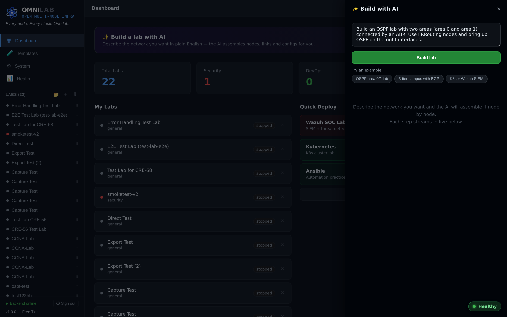

# OmniLab

> A self-hostable network lab platform — design topologies in the browser,
> deploy them to real KVM/QEMU VMs, and manage everything from a single REST
> API.

Status: pre-launch, v1.0 in active development. Tracking board:
[Linear → Creator Buddy / OmniLab v1.0](https://linear.app/harold-browder/team/CRE).

---

## Tech stack

| Layer        | Tech                                                                  |
| ------------ | --------------------------------------------------------------------- |
| Backend      | Python 3, FastAPI, Uvicorn, SQLite (aiosqlite), httpx                 |
| Frontend     | React 18, Vite 5, Zustand, React Router, ReactFlow, Three.js, xterm.js|
| Virt         | KVM / QEMU                                                            |
| Remote view  | Apache Guacamole (mounted under `/guacamole/*` via reverse proxy)     |
| Distribution | `.deb` installer, CLI, auto-update checker                            |
| Billing      | Stripe Checkout                                                       |

---

## Features

### Real-Time Traffic Visualization (Phase 3 — shipped May 2026)

Watch packets flow across your topology in real time. Backend captures live
traffic with `tcpdump` inside the running container, streams events over
WebSocket, and the canvas renders animated colored particles along each link.

- **Protocol filters** — toggle ARP, BGP, OSPF, EIGRP, STP, LLDP, ICMP, etc.;
  each protocol gets its own color
- **In-container capture** — no host-level packet sniffing; runs with
  `CAP_NET_RAW` inside the lab node
- **Live packet counters** — per-filter badge updates as packets arrive
- **Resilient WebSocket** — auto-reconnect with exponential backoff,
  Live/Offline status badge
- **Actionable errors** — specific messages for permission denied, interface
  not found, tcpdump missing, container not running (not raw stderr dumps)
- **Performance** — event batching + throttling, particle limits to keep
  large topologies smooth

Tracked under [CRE-68](https://linear.app/harold-browder/issue/CRE-68). Ship
reports for each milestone live in `docs/CRE-68_PHASE3_MILESTONE*.md`.

### AI Lab Builder (OmniLab v1.1)

Describe the lab you want in plain English and watch the agent build it. Type a
prompt — *"OSPF area 0/1 with 4 FRR routers"* — and an LLM tool-calling loop
calls the same topology + lifecycle tools the UI uses (`create_lab`,
`create_node`, `link_nodes`, `push_config`, `start_node`) to stand the lab up,
streaming each step to a live activity log.



- **Natural-language → working lab** — prompt in, deployed topology out, then
  drops you on the canvas with the new lab loaded
- **Streaming activity log** — every `tool_call`/`tool_result` renders live over
  SSE, with collapsible agent "thinking" and a red **Stop** button that cancels
  gracefully between tool calls (and tears down the half-built lab)
- **Bring-your-own key** — OpenRouter by default, plus Anthropic / OpenAI /
  custom OpenAI-compatible endpoints; keys are stored encrypted and never echoed
- **Cost rails** — hard per-call `max_tokens`, capped iterations + tool calls,
  and auto-cleanup so a runaway build can't orphan containers or burn budget
- **Run history** — every build is persisted (prompt, status, lab, tokens) with
  re-run / view-lab actions

Six curated demo scenarios (OSPF, eBGP, 3-tier campus, Kali+DVWA pentest, k3s
cluster, Wazuh SOC) live in `tests/agent_scenarios.json`; the recordable demo
script is in [`docs/demo-script.md`](docs/demo-script.md). Tracked under
[CRE-41–CRE-48](https://linear.app/harold-browder/project/omnilab-v11-ai-lab-builder).

### Other capabilities

- KVM/QEMU + Docker-backed lab nodes with one-click deploy from templates
- ReactFlow topology editor with persistent layout
- Apache Guacamole console for VM remote view (RDP/VNC/SSH)
- JWT-based multi-user auth with three roles (admin, power-user, readonly)
- REST API for everything — migrate from EVE-NG/GNS3 with the bundled tools,
  no more manual `fixpermissions`

---

## Repository layout

```
omnilab/
├── backend/        FastAPI app — main.py + api/*.py routers, core/, services/
├── frontend/       Vite + React SPA — src/, dist/ (built bundle served by FastAPI)
├── docs/           Operator + developer docs
└── README.md       (this file)
```

Runtime data lives outside the repo at `~/.omnilab/` (database, snapshots, lab
state, VM images).

---

## Running locally

```bash
# Backend (Python venv lives at ~/omnilab-env)
source ~/omnilab-env/bin/activate
cd backend
python main.py                 # listens on :5000

# Or use the supervised loop:
~/start-omnilab.sh             # while-true respawn

# Frontend (dev mode with HMR)
cd frontend
npm install
npm run dev                    # listens on :5173
```

**⚠️ Security Notice:**  
OmniLab v1.0 ships with **JWT-based multi-user authentication** (CRE-53). Three roles: admin, power-user, readonly. See [docs/MIGRATION.md](docs/MIGRATION.md) for setup.

For localhost-only testing, you can run without auth. **Never** expose port 5000 to the internet without authentication enabled.

Health check: `curl http://localhost:5000/api/system/health`

**Production Deployment:**  
NAT networks and packet capture require `CAP_NET_ADMIN` privileges. See [docs/DEPLOYMENT.md](docs/DEPLOYMENT.md) for Docker/Kubernetes/bare-metal setup.

**Migrating from EVE-NG or GNS3?**  
See [docs/MIGRATION.md](docs/MIGRATION.md) for automated migration tools. **No more manual `fixpermissions` commands!** OmniLab API handles permissions automatically.

---

## Lab templates

OmniLab ships with 10 pre-configured "golden lab" templates that one-click
deploy into a working topology (Docker-backed nodes today, KVM-backed nodes
coming in v1.1). The full ledger of templates and their current status —
plus the smoke-test harness used to verify them — lives in
[docs/TEMPLATES.md](docs/TEMPLATES.md).

To verify all templates end-to-end against the live docker daemon:

```bash
~/omnilab-env/bin/python ~/omnilab/scripts/smoke_test_templates.py
```

This deploys each template, starts every node, verifies the containers are
actually running (not "exited-after-init"), hits the web-UI reverse proxy
for nodes that expose one, and cleans up between templates. Results land at
`/tmp/smoke_test_results.json`.

---

## Development workflow

See [docs/CLAUDE_TOOLING.md](docs/CLAUDE_TOOLING.md) for the canonical
session-start runbook (WeTTY + Claude Desktop Cowork) and the list of pitfalls
to avoid (FastAPI catch-all ordering, heredoc/JSX gotchas, backend respawn
behavior, etc.).

All work is tracked in Linear under the **CRE** team. Issues are assigned to
the engineer driving them and moved through `Backlog → Todo → In Progress →
Done`.

**Competitive Analysis:**  
See [docs/EVE_NG_COMPETITIVE_ANALYSIS.md](docs/EVE_NG_COMPETITIVE_ANALYSIS.md) for ongoing systematic documentation of EVE-NG features, UI/UX patterns, and workflows. This analysis drives OmniLab's roadmap toward feature parity and superiority.

---

## License

Proprietary — © Harold Browder. All rights reserved (pending public license
decision before v1.0 launch).
